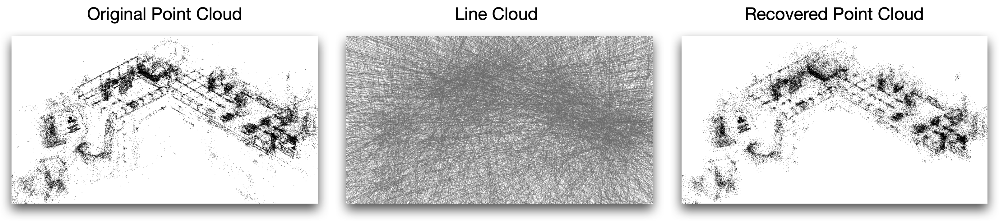
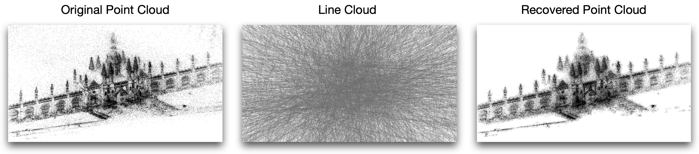
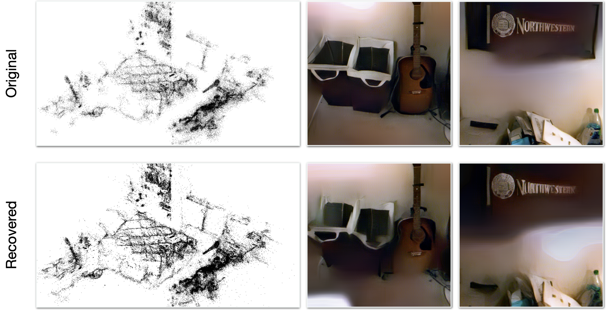

# Obtain Point clouds from Uniform Line Clouds


Reference code for our CVPR 2021 [[paper]](https://openaccess.thecvf.com/content/CVPR2021/html/Chelani_How_Privacy-Preserving_Are_Line_Clouds_Recovering_Scene_Details_From_3D_CVPR_2021_paper.html) titled "How privacy preserving are Line Clouds? Recovering Scene Details from 3D Lines". 

[[Link]](https://youtu.be/PdwGHHizKXM) to presentation video.

If you use this code/model for your research, please cite the following paper:
```
@InProceedings{Chelani_2021_CVPR,
    author    = {Chelani, Kunal and Kahl, Fredrik and Sattler, Torsten},
    title     = {How Privacy-Preserving Are Line Clouds? Recovering Scene Details From 3D Lines},
    booktitle = {Proceedings of the IEEE/CVF Conference on Computer Vision and Pattern Recognition (CVPR)},
    month     = {June},
    year      = {2021},
    pages     = {15668-15678}
}
```
## Results
### Results for point clouds recovered from unifrom line clouds.
#### Indoor

#### Outdoor


### Results for point clouds recovered and images reconstructed using an inversion attack from unifrom line clouds.
#### Indoor

#### Outdoor


Please use the Issues tab for any questions about usage or theory !
